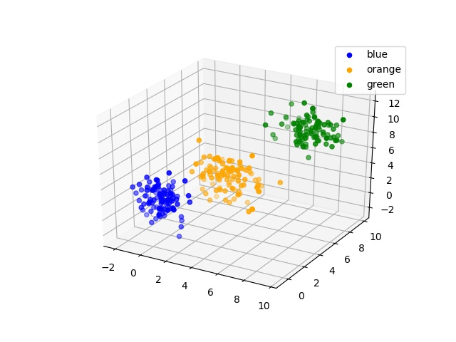
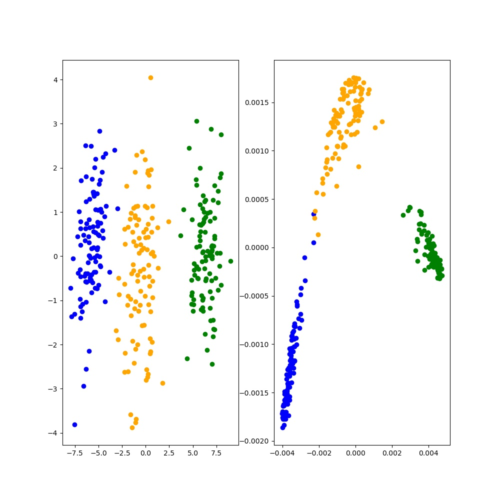

# KernelPCA
核PCA是在PCA基础上引入了核函数，通过核方法将无法线性映射的数据先投射到某一个可线性映射的高维空间中，再对高维空间中的数据进行PCA。这打破了PCA的线性映射原则，使得PCA具备了非线性映射的能力，扩大了PCA的适用范围。
# 计算步骤
* 根据核函数k(xi,xj)计算出相应的核矩阵K
* 对核矩阵进行特征分解，选取前d个特征值对应的特征向量作为投影矩阵（注：这里的每一个特征向量并不是数据的主成分）  
* 投影数据为WT@K(xi, x)  
# 实验
数据原始形状如下所示：  
  
投影数据如下所示（左边为PCA的投影点，右边为KPCA的投影点）：  

